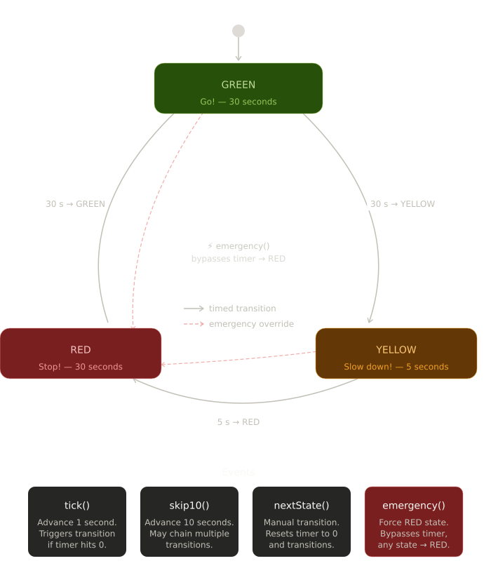

# 🚦 Traffic Light FSM Simulator

A **Finite State Machine** simulation of a traffic light system, implemented in C++ using Object-Oriented Programming principles. This project bridges software design and digital hardware — the same FSM logic is represented both in C++ code and as a real logic gate circuit (74LS163 counters).

---

## FSM Diagram



---

## Overview

The simulator models a 3-state traffic light with timed automatic transitions and an emergency override event. The FSM cycles through:

| State  | Duration | Behavior        |
|--------|----------|-----------------|
| 🟢 GREEN  | 30 seconds | Vehicles proceed |
| 🟡 YELLOW | 5 seconds  | Vehicles slow down |
| 🔴 RED    | 30 seconds | Vehicles stop |

The hardware counterpart (see `docs/Traffic_Light_FSM_logic_gates.pdf`) implements the same FSM using **74LS163 synchronous counters** and combinational logic gates.

---

## C++ Concepts Demonstrated

- **Polymorphism** — `TrafficState` is an abstract base class with pure virtual methods. `GreenState`, `YellowState`, and `RedState` override `getName()` and `getDuration()` at runtime.
- **State Design Pattern** — Each state is encapsulated in its own class, decoupling state-specific behavior from the FSM controller.
- **Dynamic Memory Management** — State objects are heap-allocated with `new`/`delete`. The copy constructor and assignment operator are explicitly deleted to prevent unsafe duplication.
- **File I/O** — Simulation events are logged to `traffic_light_logs.txt` on exit.
- **Exception Handling** — Invalid user commands throw and catch `std::invalid_argument`.

---

## Project Structure

```
TrafficLight-FSM/
├── src/
│   ├── main.cpp            # Entry point and interactive event loop
│   ├── TrafficLight.cpp    # FSM controller implementation
│   ├── TrafficLight.hpp    # FSM controller interface
│   └── TrafficState.hpp    # Abstract base class + state subclasses
├── docs/
│   ├── Traffic_Light_FSM_Diagram.png
│   └── Traffic_Light_FSM_logic_gates.pdf
├── logs/
│   └── traffic_light_logs.txt
├── CMakeLists.txt
└── README.md
```

---

## Build & Run

### Requirements
- C++17 or later
- CMake 3.10+

### Using CMake

```bash
mkdir build
cd build
cmake ..
cmake --build .
./traffic_light
```

### Manual Compilation (g++)

```bash
g++ -std=c++17 -Wall src/main.cpp src/TrafficLight.cpp -o traffic_light
./traffic_light
```

---

## Events / Commands

Once running, the simulator accepts the following commands:

| Command     | Description                                              |
|-------------|----------------------------------------------------------|
| `tick`      | Advance 1 second. Triggers a transition if timer hits 0. |
| `skip10`    | Advance 10 seconds. May chain multiple transitions.      |
| `next`      | Manually transition to the next state. Resets timer.     |
| `emergency` | Force RED immediately. Bypasses timer from any state.    |
| `exit`      | Save logs to file and quit.                              |

### Example Session

```
==============================
Current State : GREEN - Go!
Time Remaining: 30 seconds
Enter command: skip10

==============================
Current State : GREEN - Go!
Time Remaining: 20 seconds
Enter command: next
Manual transition executed.

==============================
Current State : YELLOW - Slow down!
Time Remaining: 5 seconds
Enter command: emergency
==============================
EMERGENCY!!! Switching to RED.
```

---

## Hardware Implementation

The FSM is also implemented at the gate level using:
- **74LS163** synchronous 4-bit binary counters for timing (30s / 5s)
- **D flip-flops** for state storage
- Combinational logic for state transitions and emergency override

See `docs/Traffic_Light_FSM_logic_gates.pdf` for the full schematic.

---

## Author

First-year Electrical Engineering student project.  
Demonstrates the connection between software FSM design and digital logic hardware.
